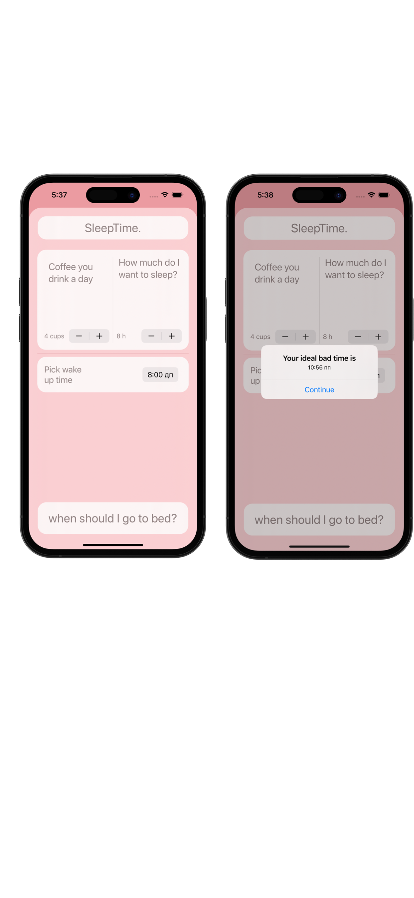
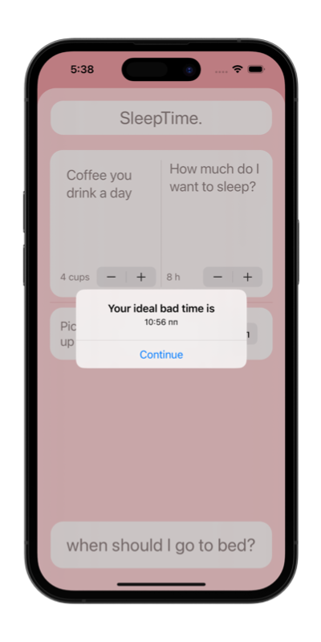

# &nbsp; BetterRest

### Project 4  
##### Author: *[MatviiArtemenko](https://github.com/100DaysOfSwiftUI-MatviiArtemenko)*

##### 100DaysOfSwiftUI form *[@twostraws](https://twitter.com/twostraws "twostraws twitter page")*

##### Follow along: *[100DaysOfSwiftUI](https://www.hackingwithswift.com/100/swiftui "Hacking with Swift")*

---

> *This project gave you the chance to get some practice with forms and bindings, while also introducing you to `DatePicker`, `Stepper`, `Date`, `DateComponents`, and more, while also seeing how to place buttons into the navigation bar – these are things you’ll be using time and time again, so I wanted to get them in nice and early.*

---

## &nbsp; 📚 Covered topics

  DatePicker, Stepper, Date, DateComponents, DateFormatter, Create ML, Core ML

---
## &nbsp; 🎖 Challenge
* [x] Replace each `VStack` in our form with a `Section`, where the text view is the title of the section. Do you prefer this layout or the `VStack` layout? It’s your app – you choose!

* [x] Replace the “Number of cups” `Stepper` with a `Picker` showing the same range of values.

* [x] Change the user interface so that it always shows their recommended bedtime using a nice and large font. You should be able to remove the “Calculate” button entirely. 
 

---
## &nbsp; 📲 Screenshoot

  
  

<!-- add screenshots here!!! -->
---
##  &nbsp; 🔍 &nbsp; Resources 

* [Hacking With Swift - BetterRest](https://www.hackingwithswift.com/books/ios-swiftui/betterrest-wrap-up)
* [Apple documentation - DatePicker](https://developer.apple.com/documentation/swiftui/datepicker/)
